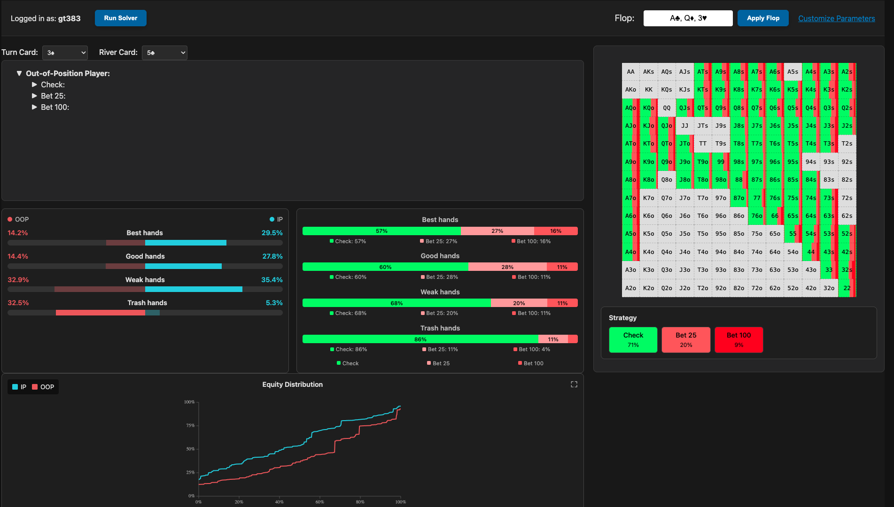
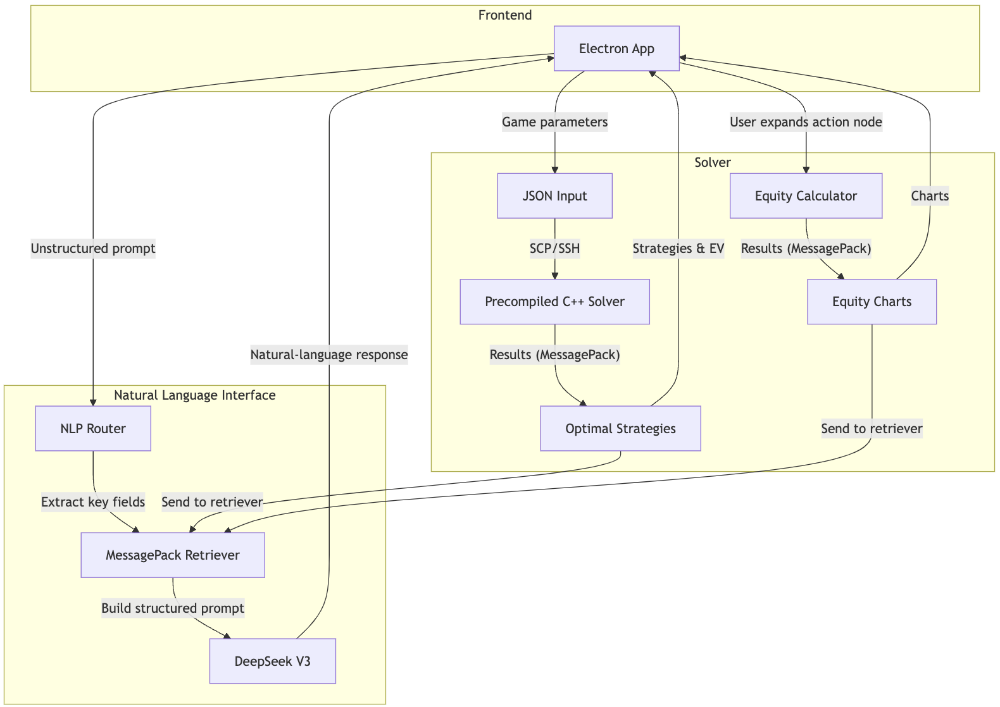
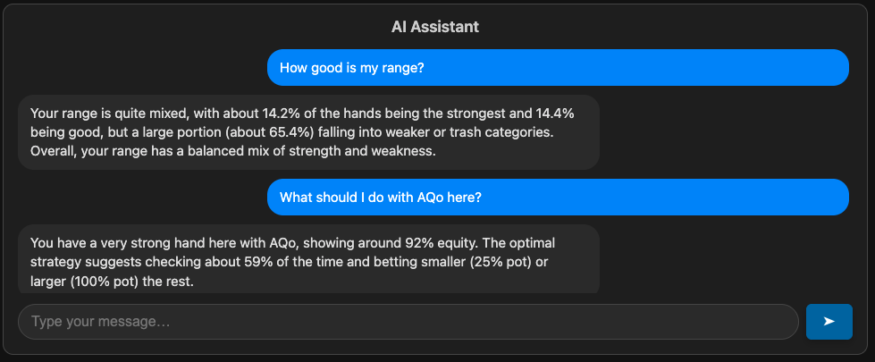
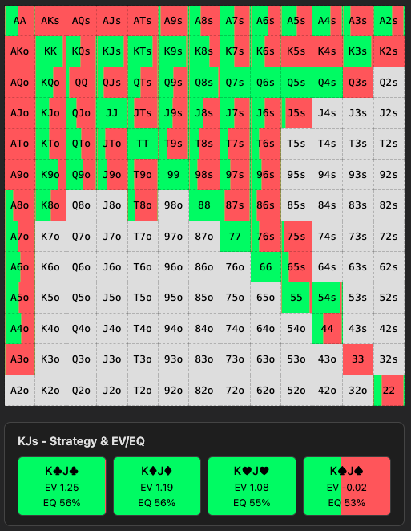
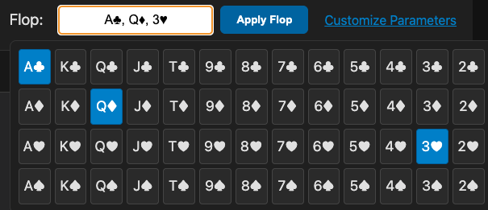
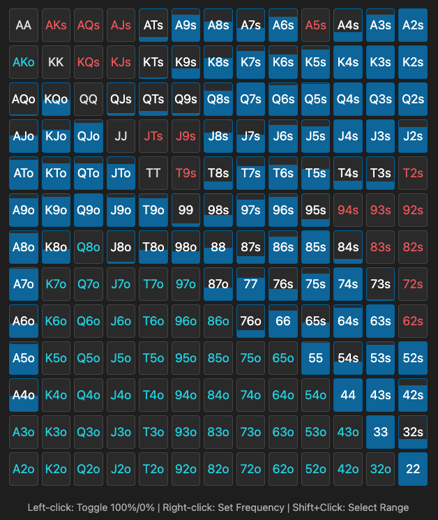

# Poker Strategy Simplified: An AI-Powered GTO Solver

[](https://opensource.org/licenses/MIT) [](https://github.com/gabrielthomazvieira/yale-poker-solver/issues) An open-source Game Theory Optimal (GTO) solver for Heads-Up No-Limit Hold'em (HUNL), designed to provide a feature-rich, accessible, and user-friendly alternative to expensive commercial software and limited free tools. This project integrates a Discounted Counterfactual Regret Minimization (DCFR) solver backend, executed on Yale's Zoo cluster, with a cross-platform Electron frontend, enhanced visualizations, and an AI chatbot for natural language interaction.


*Figure: Main application interface showing game tree, strategy heatmap, and equity visualizations.*

## Key Features

* **HUNL GTO Solver:** Implements the Discounted Counterfactual Regret Minimization (DCFR) algorithm.
* **Remote Computation:** Leverages the Yale Zoo cluster for computationally intensive solving tasks via SSH/SCP (requires Yale Zoo account).
* **Cross-Platform UI:** Built with Electron for use on different desktop operating systems.
* **Interactive Game Tree:** Visualize and navigate the decision tree of the solved game.
* **Advanced Visualizations:**
    * Optimal strategy heatmaps showing action frequencies for each hand.
    * Detailed EV/Equity breakdown on hover.
    * Equity distribution plots and bucketing ("strong", "good", "weak", "trash" hands).
* **AI-Powered Chatbot:** Uses DeepSeek V3 via the OpenAI SDK to answer natural language questions about optimal strategy, hand strength, and EV, using context from the solver's output.
* **Customizable Inputs:** Set board cards, starting ranges, stack sizes, pot size, and bet sizes.
* **Efficient Data Handling:** Uses MessagePack for compact solver output and a lazy-loading SQLite database backend to handle large game trees efficiently in the UI.

## Architecture Overview

The system consists of:

1.  **Electron Frontend:** Provides the GUI, manages user inputs, displays results, and handles communication.
2.  **C++ Solver Backend:** A pre-compiled DCFR solver using C++17 and OpenMP for parallelism. This binary is transferred via SCP and executed via SSH on a Yale Zoo node.
3.  **Yale Zoo Cluster:** Provides the Linux environment and computational resources for running the solver and the `holdem-eval` equity calculator.
4.  **Data Pipeline:**
    * Inputs serialized as JSON.
    * Solver outputs compact MessagePack data.
    * Large game trees pre-processed and stored in an SQLite database on the Zoo node for lazy loading via a Python script intermediary.
5.  **AI Integration:** Python script interfaces with the DeepSeek V3 API, embedding solver data into prompts.
6.  **Equity Calculation:** Uses the external `holdem-eval` library invoked via shell scripts on the Zoo.


*Figure: High-level system architecture diagram.*

## Technology Stack

* **Frontend:** Electron
* **Solver:** C++17, OpenMP
* **AI:** DeepSeek V3 API, OpenAI Python SDK
* **Equity:** `holdem-eval` (external C library)
* **Data:** JSON, MessagePack (`msgpack-c`), SQLite, Python
* **Libraries:** `nlohmann/json` (C++), [Mention other key JS/Node libraries if applicable]
* **Infrastructure:** Yale Zoo Linux Cluster, SSH, SCP

## Performance

* The core DCFR algorithm achieves the target 0.5% exploitability threshold in times comparable to the TexasSolver benchmark (~17s vs. ~13s average on test scenarios with 30 threads).
* **Bottleneck:** There is significant overhead when saving the *full* solution data (up to the river), primarily related to data serialization and storage into the SQLite database. Wall clock time increases dramatically, and CPU utilization drops significantly compared to the benchmark under these conditions. Optimization of this serialization/storage process is a key area for future work.


*Figure: Example interaction with the AI chatbot.*


*Figure: Optimal strategy heatmap with detailed hover information.*

## Installation

**Prerequisites:**

* Node.js and npm
* Access to Yale Zoo cluster with SSH key authentication configured.
* You can build the solver binary locally by running `./build.sh` at the `solver` directory.

**Steps:**

1.  **Clone the repository:**
    ```bash
    git clone [https://github.com/gabrielthomazvieira/yale-poker-solver.git](https://github.com/gabrielthomazvieira/yale-poker-solver.git)
    cd yale-poker-solver
    ```
2.  **Install dependencies:**
    ```bash
    npm install
    ```
3.  **Build the packaged application:**
    ```bash
    npm run make
    ```

## Usage

1.  Launch the application.
2.  Enter your Yale Zoo credentials when prompted. The application uses these for SCP/SSH access.
3.  Configure the poker scenario:
    * Select flop cards.
    * Define player ranges using the range selection tool.
    * Set stack sizes, pot size, and allowed bet sizes.
    * (See Figures below for UI examples)
4.  Click the "Solve" button (or equivalent). The application will transfer the solver, run it on the Zoo, and retrieve the results.
5.  Explore the solved game tree, examine the strategy charts and equity distributions.
6.  Use the integrated chatbot to ask questions about the current game state or specific hands.


*Figure: Flop selection interface.*


*Figure: Range selection interface.*

## License

This project is licensed under the GNU Affero General Public License v3.0 License - see the LICENSE.md file for details.

## Acknowledgements

* Advised by Timos Antonopoulos.
* Utilizes the resources of the Yale Zoo cluster.
* Leverages open-source libraries including Electron, `holdem-eval`, `nlohmann/json`, `msgpack-c`, and others.
* Inspired by the open-source TexasSolver project.
